# 1.1 Ejercicio 1 

## **Creación de Repositorio**  
Vamos a crear una carpeta la cual llamaremos repo1, ahora en visual studio code, iniciamos con el terminal en bash, haciendo **GIT  INIT** de la siguiente manera

 

# 1.3 Stagin area  

Nuestro fichero ahora si se hace un **GIT ADD .** el punto nos permitirá iniciar dentro de la carpeta 

 

ahora nuestro archivos se encuentran en **stagin area**, procedemos a subirlo con...

### **GIT Commit**  

procedemos a subir nuestros archivos a nuestro repositorio local

 

# 1.4 Git Push  

Ahora trataremos de enviar el git a la nube

nos damos cuenta que no  tenemos un destino para el repositorio que se  encuentra en la nube

# 1.5 Git Remote 

si ejecutamos  este comando 

nos nos saldra ningun contenido porque lo que esta haciendo es mostrar si tenemos un repositorio remoto.

# 1.6 Repositorio Remoto

Crearemos un repositorio remoto

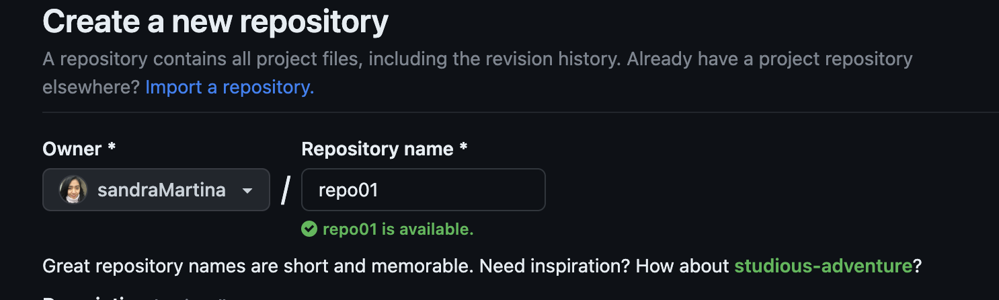

ahora lo asociamos a nuetro repositorio local 

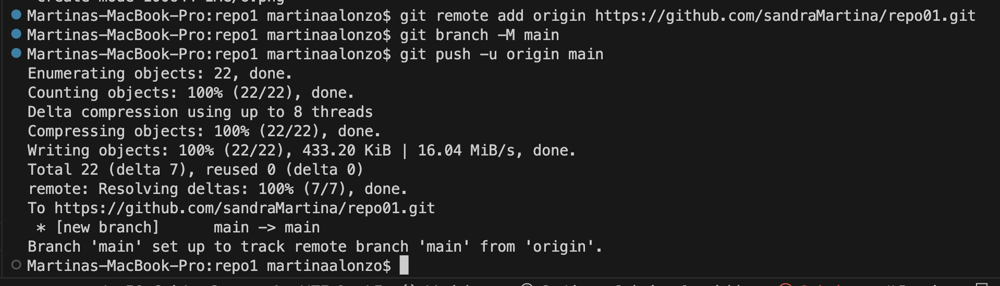

# 1.7 Git Rem -v
Si solvemos a ejecutar el comando de git remote -v nos daremos cuenta de lo siguiente:
Indica que nuestro repositorio local se ha podido asociar al repositorio remoto

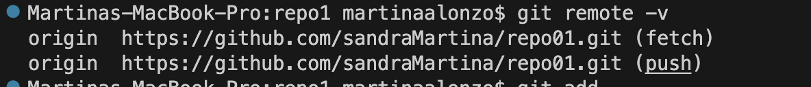

# 1.8 Commit local

Para subir los cambios que hemos hechos en el local para el repositorio remoto, lo que tendremos que hacer es un git push.

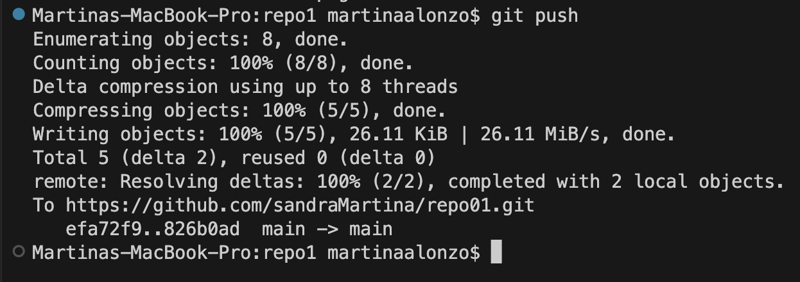

# 1.9 Repositorio remoto

>Hemos agregado cada repositorio con un git add.
>>subimos los repositorios con un git commit

>>>Finalmente agregamos esos repositorios a un repositorio remoto

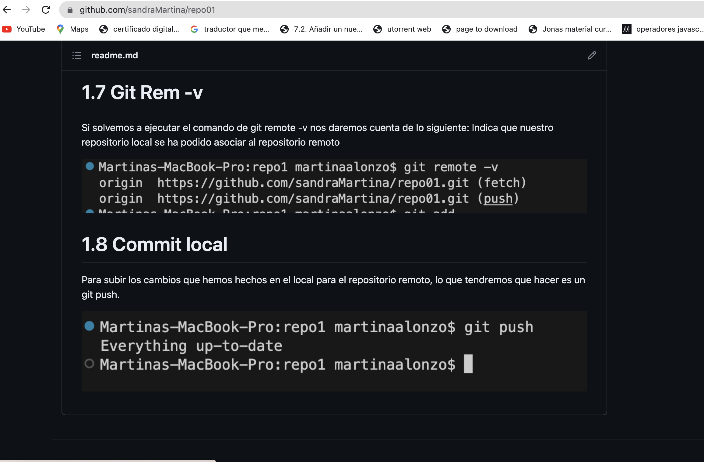

#  Ejercicio 2

## 2.1 Creación  repositorio remoto
si hemos creamos un repositorio en github,  este sera un repositorio remoto

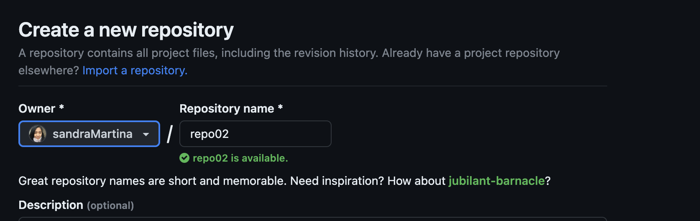

## 2.2 Clonacion repositorio

Se ha comentado que la forma practica para trabajar en un repositorio es clonarlo, por lo tanto procederemos a hacerlo.

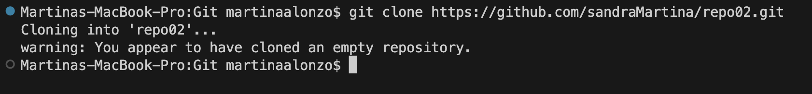

## 2.3 Fichero Readme

Vamos a crear un fichero readme.md dentro del repositorio que hemos clonado, agregamos el repositorio a stagin area, y ahora con un commit, lo subiremos a nuestro repositorio loccal

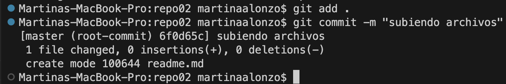

## 2.4 Manual Marckdown

este paso ya lo haremos en el siguiente repositorio que hemos creado y sobre la cual se ha crado el readme.

# 3.1 Bloque GIT:v: 

Bloque de ejercico de git

# 4.1 FAST FORWARD :v: 
El fast forward es que nos permite agregar un brach a la rama principal, este automaticamente se utiliza.

>Creamos una carpeta la cual llamaremos repo04, 
>>agregamos un **readme.md**, e iniciamos
iniciamos nuestra carpeta local para que sea un repositorio local.

>>> - [x] **Git init .**
>>> - [x] **Git add .**
>>> - [x] **Git commit -m "repo04"**
>>> - [x] **Creacion repositorio  remoto**
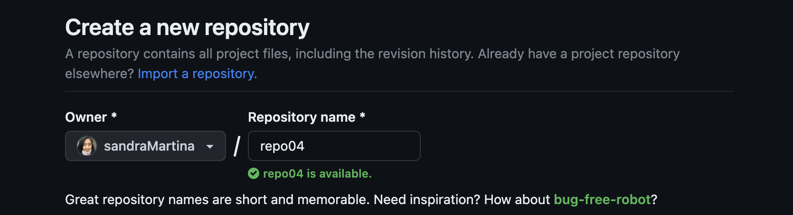

>>> - [x] **git add origin and push**
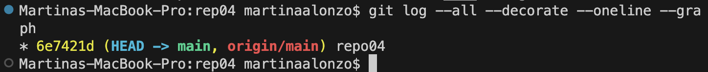

>>> - [x] **Creamos rama con nombre y fecha**
con un git branch <> podemos crear ramas, en este caso creamos una con nuestro nombre y fecha
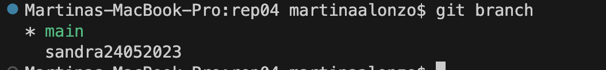

>>> - [x] **Realizamos 3 commits sobre la rama que hemos creado con nuestro nombre**
luego de hacer los commits tendremos verificamos que el head direcciona sobre nuestra branch sobre el tercer commit
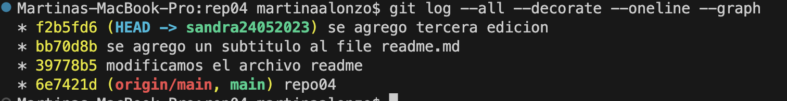

>>> - [x] **Fucionar mi rama en master**
mi branch tiene que juntarse con main, que es la rama principal, entonces nos ubicamos primero en main, seguidamente buscamos la rama, 
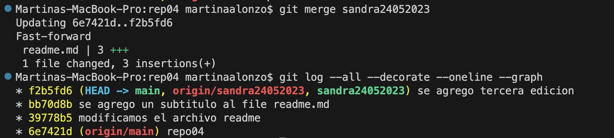

>>> - [x] **Push hacia la nube**
haremos un push hacia la nube de la siguiente manera

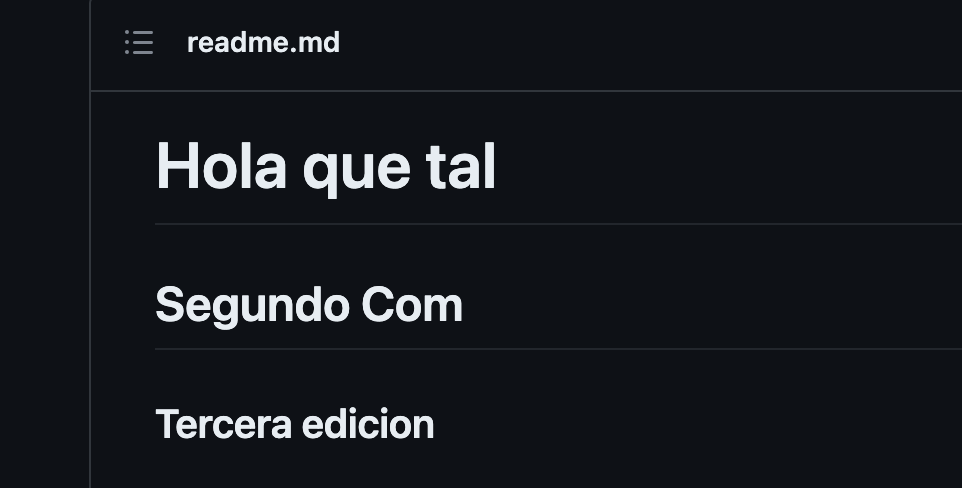

Ahora eliminamos el branch en local
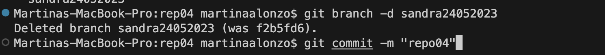

# 5.1 NO FAST FORWARD :v: 

Continuamos con nuestra actividad, seguiremos los primeros pasos del ejercicio 4, lo que nosotros necesitamos saber es la diferencia entre commits con no forwar, en la siguiente img,

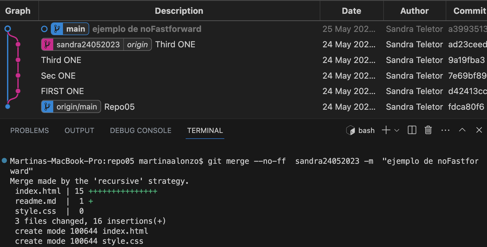

>>> - [x] **Resultado**
ahora veremos como con el comando **git log --all --decorate --oneline --graph** nos mostrar informacion importante

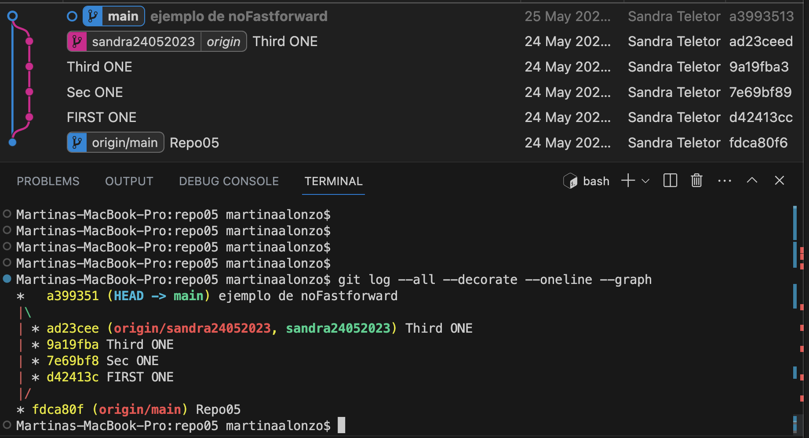

###  **Diferencia merge ff y no-ff**

Con el Merge ff, nos permite fusionar la rama a la rrama main sin autorizacion, esta es la que ejecutamos  por defecto, y con no-ff ocurre lo contrario, permitiendo un historial de su avance 