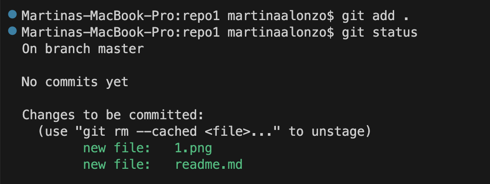

# 1.1 Creación de Repositorio  

## **Iniciar Repositorio**  
Vamos a crear una carpeta la cual llamaremos repo1, ahora en visual studio code, iniciamos con el terminal en bash, haciendo **GIT  INIT** de la siguiente manera

 

# 1.3 Stagin area  

Nuestro fichero ahora si se hace un **GIT ADD .** el punto nos permitirá iniciar dentro de la carpeta 

 

ahora nuestro archivos se encuentran en **stagin area**, procedemos a subirlo con...

### **GIT Commit**  

procedemos a subir nuestros archivos a nuestro repositorio local

 

# 1.4 Git Push  

Ahora trataremos de enviar el git a la nube

nos damos cuenta que no  tenemos un destino para el repositorio que se  encuentra en la nube

# 1.5 Git Remote 

si ejecutamos  este comando 

nos nos saldra ningun contenido porque lo que esta haciendo es mostrar si tenemos un repositorio remoto.

# 1.6 Repositorio Remoto
